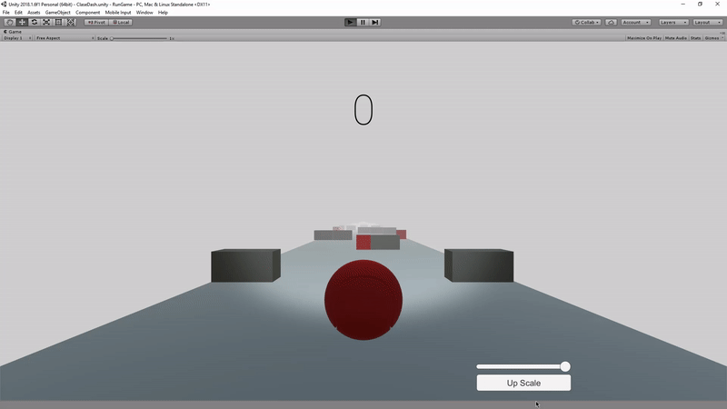
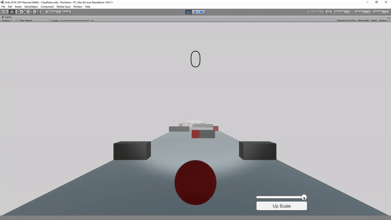

# Interfaz-de-Usuario-en-Unity

- Agregar un objeto Canvas para generar una interfaz de usuario que permita las siguientes acciones en la escena:

    - Aumentar o disminuir la intensidad de una de las fuentes de luz.
    - Aumentar o disminuir el tamaño de los objetos A de la escena.

---

### Proyecto

- Se ha añadido una interfaz gráfica de usuario, un botón y un slider.
- El botón cumple la función de aumentar el tamaño de los obstaculos de color gris.
- El slider aumenta o disminuye la intensidad de luz del foco de la bola.

